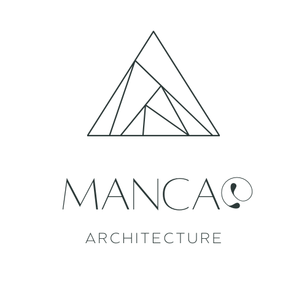

# IT-Skills
# MOE
> Architecture, identity, and things that shouldn't quite make sense.

## About Me
Hi! I'm Morven Kent Mancao, an architecture student interested in
architecture, visual identity, fashion, and experimental design.
I explore the relationship between space, identity, and visual
expression through architectural work and creative projects.
## My Brand
- Hot Pink — Primary Color
- Off-White — Secondary Color
- Medium Gray — Neutral Color
My visual identity combines playful forms, soft geometry, and
experimental digital aesthetics.
## Portfolio
This repository contains selected assets from my personal visual
identity, including my logo, banner, and color palette.
